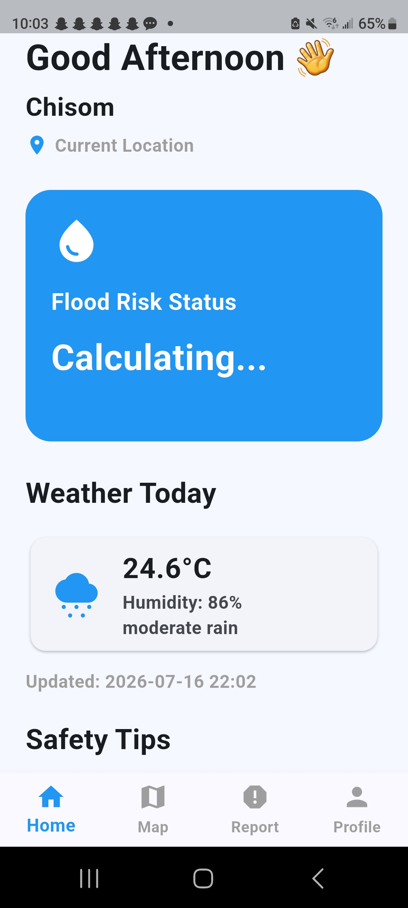
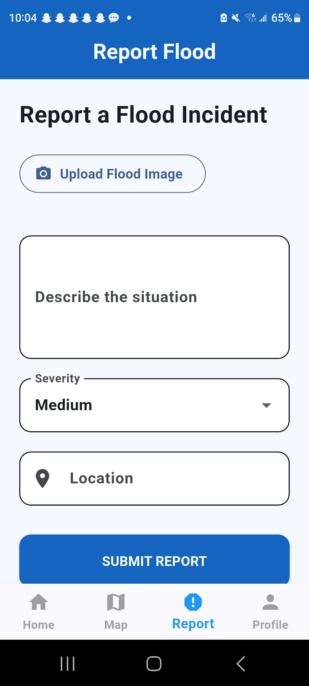
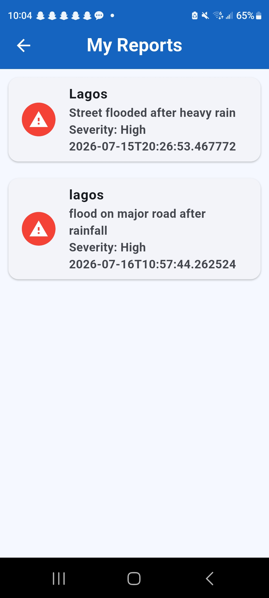
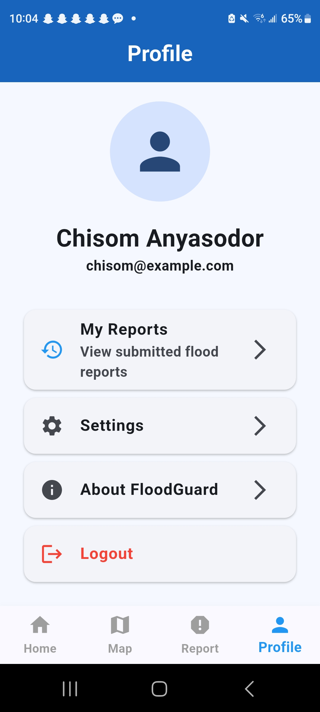

# 🌊 FloodGuard

A Flutter-based flood monitoring and reporting mobile application powered by AWS serverless technologies.

FloodGuard helps users monitor weather conditions, assess flood risks, and report flood incidents with images and location details.

---

# 📱 Features

## 🌦 Real-Time Weather Monitoring
- Fetches current weather conditions
- Displays temperature, humidity and weather status
- Uses user location for weather updates

## 🚨 Flood Risk Monitoring
- Displays current flood risk level
- Provides safety recommendations during dangerous conditions

## 📸 Flood Incident Reporting
Users can:
- Upload flood images
- Add descriptions
- Select flood severity
- Submit incident reports

## ☁️ Cloud Image Storage
Flood images are uploaded securely using:
- Amazon S3
- Lambda generated pre-signed URLs

## 📋 My Reports Dashboard
Users can:
- View previously submitted flood reports
- See report details and timestamps

## 👤 User Profile
Includes:
- User information
- App settings
- Logout functionality

## 📸 Screenshots

### Home Dashboard

### Flood Report

### My Reports

### Profile

